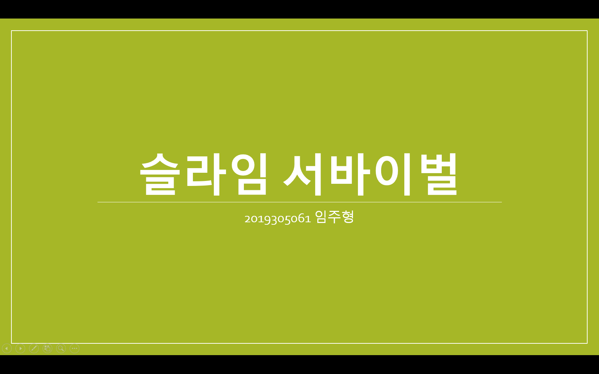
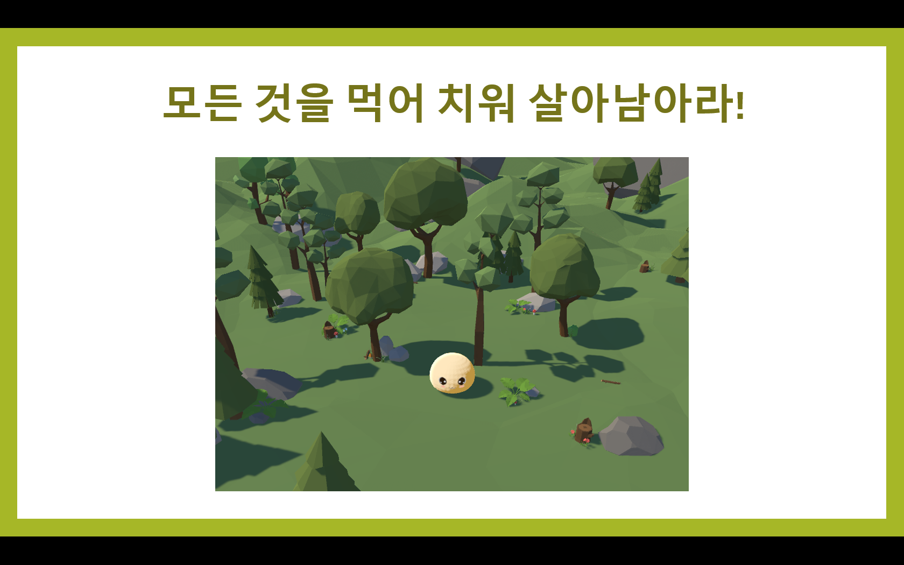
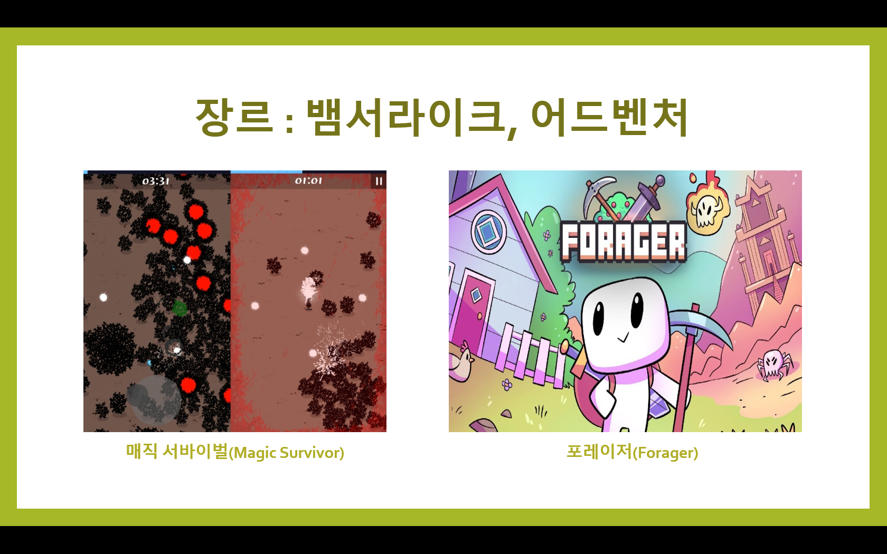
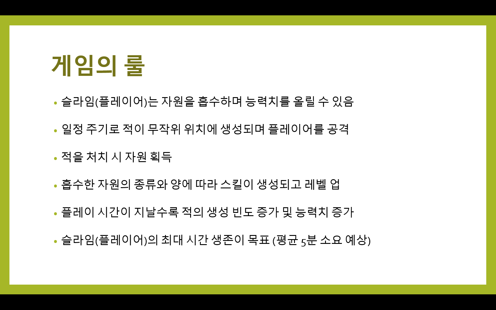
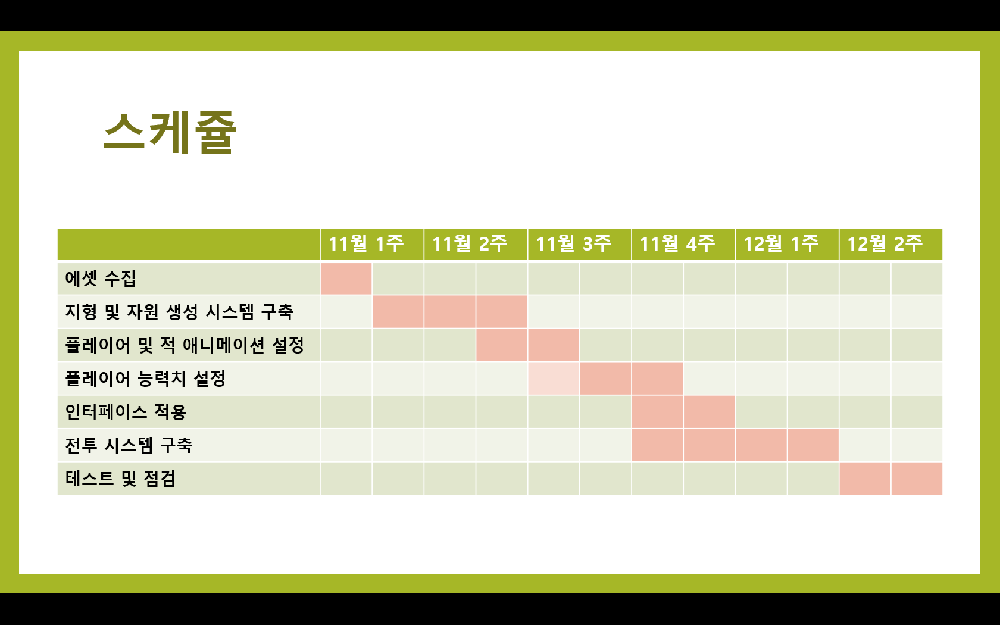
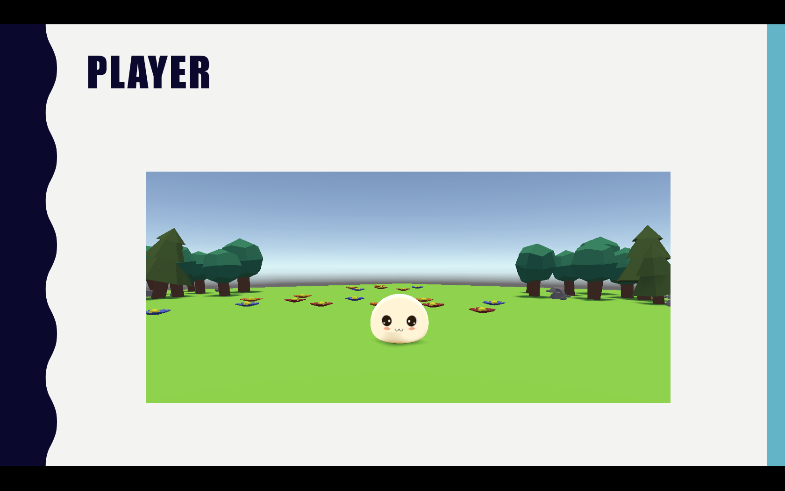
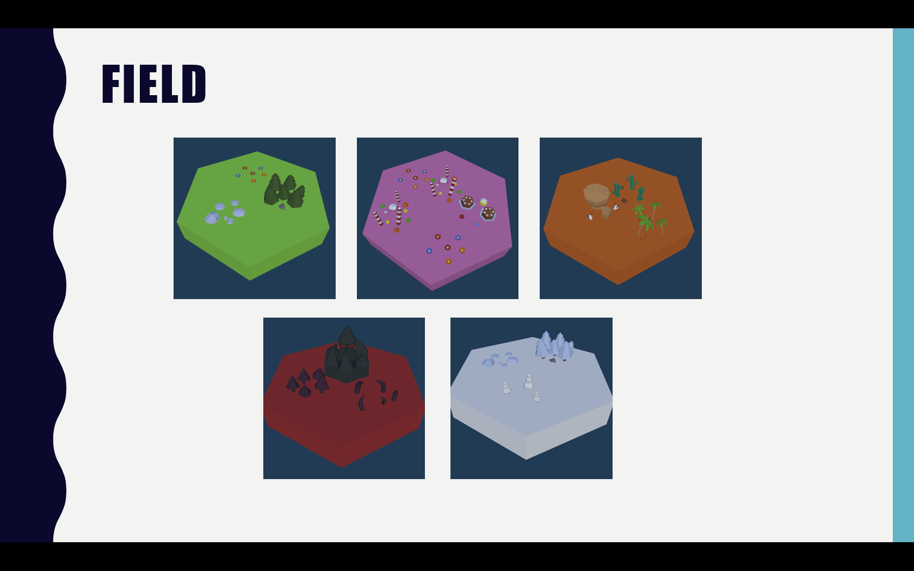
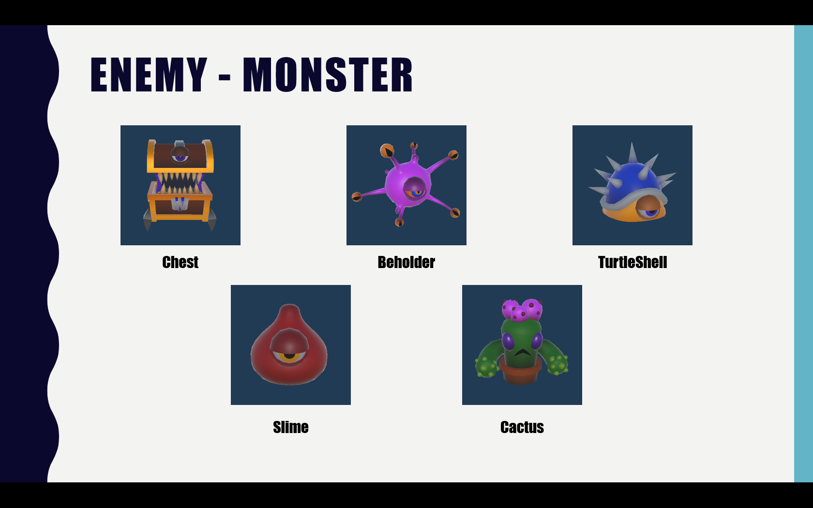
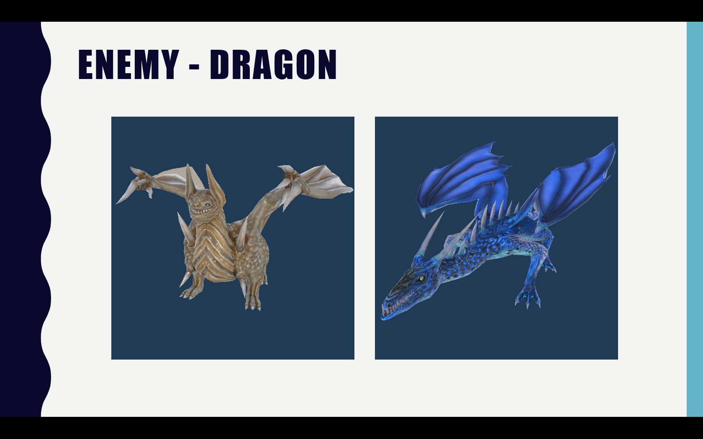
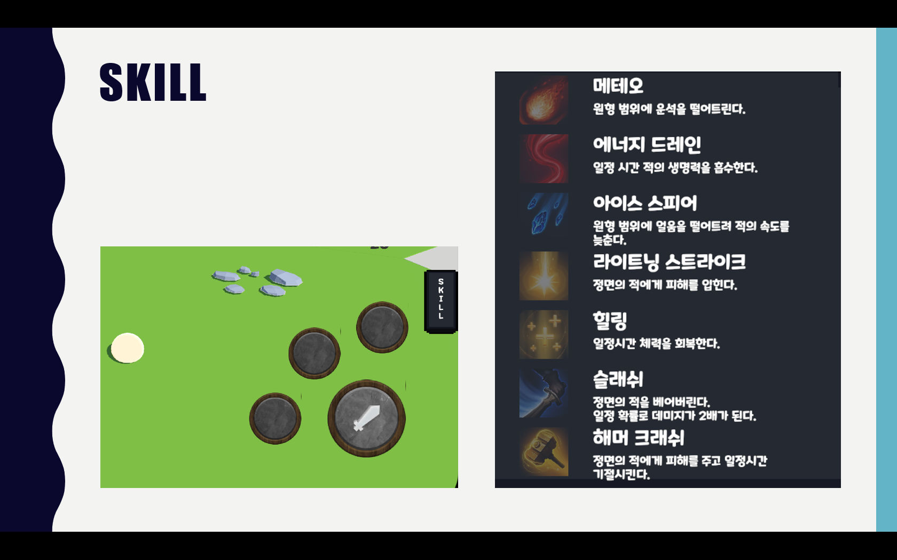

### 💥 Slime Survival (로그라이크 생존 게임)

- **장르**: 로그라이크 성장형 3D 생존 액션
- **개발 기간**: 2023.09 ~ 2023.12
- **사용 기술**: Unity, C#

- **주요 기능**:
  - 자원 흡수 기반 스킬 획득 시스템
  - 시간 경과에 따라 난이도가 상승하는 적 생성 알고리즘
  - 스킬 선택 UI 시스템 구현

- **기여 내용**:
  - 적 처치 시 드롭되는 자원을 흡수해 능력치를 강화하는 시스템 구현
  - 자원 종류에 따라 습득 가능한 스킬이 달라지는 구조 설계
  - 플레이 시간이 지날수록 적의 등장 패턴, 속도, 수가 점진적으로 변화하는 알고리즘 개발
  - Unity의 UGUI를 활용한 스킬 UI 및 선택 인터페이스 구현

- **성과**:
  - Unity를 활용해 처음으로 완성한 Android 게임 프로젝트
  - 자원 기반 성장과 실시간 난이도 조절이라는 핵심 재미 요소를 직접 설계 및 구현
  - 개인 프로젝트로 구조 설계부터 UI 및 전투 시스템까지 전반을 독자적으로 개발
 
- - -

> ## Planning
> 
> 
> 
> 
> 
- - -
> ## Demo
> 
> 
> 
> 
> 
> 
> 
